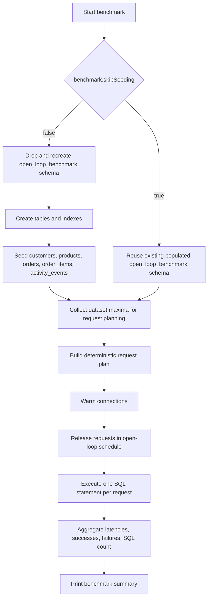

# simple-open-loop-jdbc-benchmark

Self-contained Java 21 benchmark for comparing direct PostgreSQL access through HikariCP against Open J Proxy 1.0.0 under an open-loop burst.

## Maven dependencies

```xml
<dependency>
    <groupId>org.postgresql</groupId>
    <artifactId>postgresql</artifactId>
    <version>42.7.12</version>
</dependency>
<dependency>
    <groupId>com.zaxxer</groupId>
    <artifactId>HikariCP</artifactId>
    <version>6.3.0</version>
</dependency>
<dependency>
    <groupId>org.openjproxy</groupId>
    <artifactId>ojp-jdbc-driver</artifactId>
    <version>1.0.0</version>
</dependency>
```

## Build

```bash
mvn clean package
```

## How the benchmark works



## Run PostgreSQL in Docker

The benchmark expects PostgreSQL on `localhost:5432` by default. It will create and repopulate its own `open_loop_benchmark` schema, but the target database itself must already exist.

The simplest local setup is to let the container create the benchmark database for you:

```bash
docker run --name benchmark-postgres \
  -e POSTGRES_USER=postgres \
  -e POSTGRES_PASSWORD=postgres \
  -e POSTGRES_DB=benchmark \
  -p 5432:5432 \
  -d postgres:17
```

Wait for PostgreSQL to become ready:

```bash
docker logs -f benchmark-postgres
```

If you already have a PostgreSQL container or instance running, either:

- create a database named `benchmark`, or
- point the benchmark at a different existing database with `-Dbenchmark.db.name=...`

Example manual database creation for an existing container:

```bash
docker exec -it benchmark-postgres psql -U postgres -c "CREATE DATABASE benchmark;"
```

## Run Hikari mode

This mode connects directly to PostgreSQL and warms a 100-connection Hikari pool before timing starts.

The benchmark sets the Hikari connection acquisition timeout to 10 seconds.
Use `-Dbenchmark.skipSeeding=true` if you want to reuse an already-populated `open_loop_benchmark` schema instead of recreating and reseeding it.

```bash
export BENCHMARK_DB_PASSWORD=<db-password>
mvn \
  -Dbenchmark.useOjp=false \
  -Dbenchmark.requestCount=1000 \
  -Dbenchmark.interSubmissionWaitMillis=5 \
  -Dbenchmark.db.host=localhost \
  -Dbenchmark.db.port=5432 \
  -Dbenchmark.db.name=benchmark \
  -Dbenchmark.db.user=postgres \
  compile exec:java
```

## Run OJP mode

This mode uses the Open J Proxy JDBC driver directly with no client-side pool. It assumes the OJP server is available on `localhost:1059`.

The benchmark also ships an `ojp.properties` file that asks OJP to keep its server-managed datasource pool at `minimumIdle=20` and `maximumPoolSize=20`. The idea is to simulate a microservice pattern where, for example, 5 application instances with a local max pool of 20 could otherwise open 100 direct database connections, while OJP can keep the real database connection count pinned to a smaller controlled target.

The OJP path also sets the server-managed connection acquisition timeout to 10 seconds.
The same `-Dbenchmark.skipSeeding=true` flag can be used here to reuse an existing populated benchmark schema.

Request submissions are also paced by default with a `5 ms` gap between scheduled starts. You can override that with `-Dbenchmark.interSubmissionWaitMillis=...` (or `BENCHMARK_INTER_SUBMISSION_WAIT_MILLIS`) if you want a tighter or looser open-loop arrival pattern.

If you want to run OJP in Docker with slow query segregation enabled, the upstream OJP docs require mounting the JDBC driver jars into the container first:

```bash
mkdir -p ojp-libs
curl -LO https://raw.githubusercontent.com/Open-J-Proxy/ojp/main/ojp-server/download-drivers.sh
bash download-drivers.sh ojp-libs
```

Then start OJP with host networking and slow query segregation enabled:

```bash
docker run --rm --name benchmark-ojp \
  --network host \
  -e OJP_SERVER_LOGLEVEL=ERROR \
  -e OJP_SERVER_SLOWQUERYSEGREGATION_ENABLED=true \
  -v "$(pwd)/ojp-libs:/opt/ojp/ojp-libs" \
  rrobetti/ojp:1.0.0
```

`--network host` is the simplest option when your PostgreSQL instance is already running on `localhost:5432`. If you use a different Docker networking setup, point the benchmark and OJP at a hostname the container can resolve instead of `localhost`.

```bash
export BENCHMARK_DB_PASSWORD=<db-password>
mvn \
  -Dbenchmark.useOjp=true \
  -Dbenchmark.requestCount=1000 \
  -Dbenchmark.interSubmissionWaitMillis=5 \
  -Dbenchmark.db.host=localhost \
  -Dbenchmark.db.port=5432 \
  -Dbenchmark.db.name=benchmark \
  -Dbenchmark.db.user=postgres \
  -Dbenchmark.ojp.host=localhost \
  -Dbenchmark.ojp.port=1059 \
  compile exec:java
```

## Notes

- The benchmark recreates its schema and populates realistic seed data before each run.
- Set `-Dbenchmark.skipSeeding=true` to skip schema recreation and data seeding; when you do, the benchmark expects an already-populated `open_loop_benchmark` schema and ignores the dataset sizing properties for setup.
- Unless `benchmark.skipSeeding=true` is set, the benchmark drops and recreates the `open_loop_benchmark` schema on every run, so use a dedicated PostgreSQL database and do not point it at shared data you need to keep.
- Setup and warm-up are excluded from measured benchmark time.
- The workload mix is controlled by constants in `OpenLoopJdbcBenchmark`.
- The `compile` phase is included in the run commands so they work from a clean checkout at the project root.
- Run `mvn -Dexec.args=--help compile exec:java` to print available system properties.
