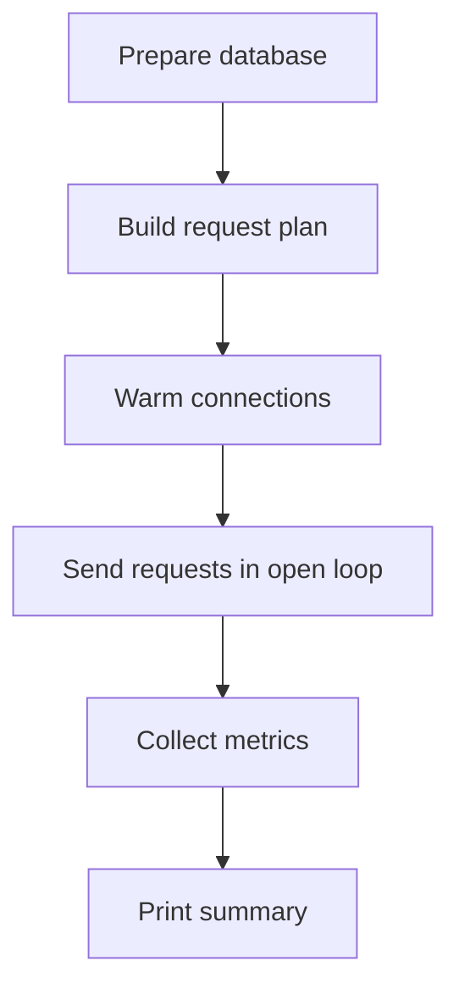

# simple-open-loop-jdbc-benchmark

Simple Java 21 benchmark for comparing:

- direct PostgreSQL access through HikariCP
- Open J Proxy (OJP) 1.0.0

The benchmark is **open-loop**:

- it prepares a fixed number of requests
- it sends them using a configurable gap between submissions
- it does not wait for one request to finish before sending the next one
- it collects latency, throughput, success, and failure metrics

## Maven dependencies

```xml
<dependency>
    <groupId>org.postgresql</groupId>
    <artifactId>postgresql</artifactId>
    <version>42.7.12</version>
</dependency>
<dependency>
    <groupId>com.zaxxer</groupId>
    <artifactId>HikariCP</artifactId>
    <version>6.3.0</version>
</dependency>
<dependency>
    <groupId>org.openjproxy</groupId>
    <artifactId>ojp-jdbc-driver</artifactId>
    <version>1.0.0</version>
</dependency>
```

## Build

```bash
mvn clean package
```

## What this tool does

You choose:

- the execution mode: Hikari or OJP
- how many requests to send
- the gap between request submissions

The most important setting is usually:

- `benchmark.requestCount`: total number of requests to send
- `benchmark.interSubmissionWaitMillis`: delay between request submissions, default `5`

This lets you control the arrival rate while keeping the test open-loop.

## Why p95 matters

The most useful latency metric in the summary is usually **p95**.

It shows the response time that **95% of requests were at or below**.
That makes it more useful than the average when a system has occasional slow requests.
In practice, p95 tells you what latency most users would see while still exposing queueing and saturation problems.

## How it works



## Run PostgreSQL in Docker

The benchmark expects PostgreSQL on `localhost:5432` by default.
It creates and repopulates its own `open_loop_benchmark` schema, but the database itself must already exist.

The simplest setup is to let Docker create the `benchmark` database:

```bash
docker run --name benchmark-postgres \
  --shm-size=1g \
  -e POSTGRES_USER=postgres \
  -e POSTGRES_PASSWORD=postgres \
  -e POSTGRES_DB=benchmark \
  -p 5432:5432 \
  -d postgres:17
```

The extra shared memory helps with concurrent reporting queries.
If you still see PostgreSQL shared-memory errors, increase `--shm-size`.

Wait for PostgreSQL to become ready:

```bash
docker logs -f benchmark-postgres
```

If you already have a PostgreSQL container or instance running, either:

- create a database named `benchmark`, or
- point the benchmark at a different existing database with `-Dbenchmark.db.name=...`

Example manual database creation for an existing container:

```bash
docker exec -it benchmark-postgres psql -U postgres -c "CREATE DATABASE benchmark;"
```

## Run Hikari mode

This mode connects directly to PostgreSQL.
It warms a 100-connection Hikari pool before the timed part starts.

The Hikari connection acquisition timeout is 10 seconds.
Use `-Dbenchmark.skipSeeding=true` to reuse an existing populated `open_loop_benchmark` schema.

```bash
export BENCHMARK_DB_PASSWORD=<db-password>
mvn \
  -Dbenchmark.useOjp=false \
  -Dbenchmark.requestCount=1000 \
  -Dbenchmark.interSubmissionWaitMillis=5 \
  -Dbenchmark.db.host=localhost \
  -Dbenchmark.db.port=5432 \
  -Dbenchmark.db.name=benchmark \
  -Dbenchmark.db.user=postgres \
  compile exec:java
```

## Run OJP mode

This mode uses the Open J Proxy JDBC driver directly with no client-side pool.
It assumes the OJP server is available on `localhost:1059`.

The benchmark also ships an `ojp.properties` file that asks OJP to keep its server-managed datasource pool at `minimumIdle=20` and `maximumPoolSize=20`.
This matches the comparison goal: several service instances could easily create 100 direct database connections, while OJP can keep the real database connection count lower and controlled.

The OJP server-managed connection acquisition timeout is also 10 seconds.
The same `-Dbenchmark.skipSeeding=true` flag can be used here to reuse an existing populated benchmark schema.

Request submissions use a default gap of `5 ms` between scheduled starts.
You can change that with `-Dbenchmark.interSubmissionWaitMillis=...` (or `BENCHMARK_INTER_SUBMISSION_WAIT_MILLIS`) to make the open-loop arrival pattern faster or slower.

If you want to run OJP in Docker with slow query segregation enabled, first download the JDBC driver jars:

```bash
mkdir -p ojp-libs
curl -LO https://raw.githubusercontent.com/Open-J-Proxy/ojp/main/ojp-server/download-drivers.sh
bash download-drivers.sh ojp-libs
```

Then start OJP:

```bash
docker run --rm --name benchmark-ojp \
  --network host \
  -e OJP_SERVER_LOGLEVEL=ERROR \
  -e OJP_SERVER_SLOWQUERYSEGREGATION_ENABLED=true \
  -v "$(pwd)/ojp-libs:/opt/ojp/ojp-libs" \
  rrobetti/ojp:1.0.0
```

`--network host` is the simplest option when PostgreSQL is already running on `localhost:5432`.
If you use a different Docker network, point the benchmark and OJP at a hostname the container can resolve.

```bash
export BENCHMARK_DB_PASSWORD=<db-password>
mvn \
  -Dbenchmark.useOjp=true \
  -Dbenchmark.requestCount=1000 \
  -Dbenchmark.interSubmissionWaitMillis=5 \
  -Dbenchmark.db.host=localhost \
  -Dbenchmark.db.port=5432 \
  -Dbenchmark.db.name=benchmark \
  -Dbenchmark.db.user=postgres \
  -Dbenchmark.ojp.host=localhost \
  -Dbenchmark.ojp.port=1059 \
  compile exec:java
```

## Notes

- The benchmark recreates its schema and seed data before each run unless `-Dbenchmark.skipSeeding=true` is set.
- Setup and warm-up are not included in the measured benchmark time.
- The run commands include `compile` so they work from a clean checkout.
- Run `mvn -Dexec.args=--help compile exec:java` to print all available system properties.
